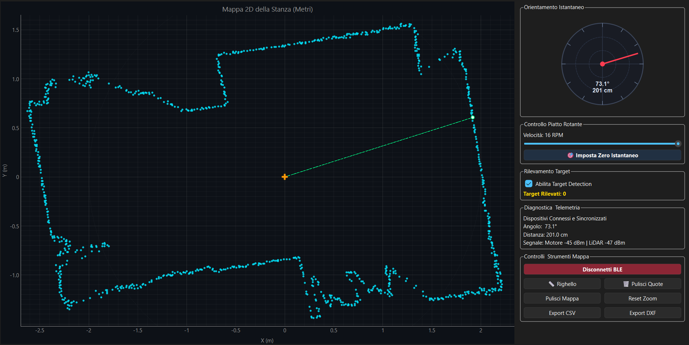
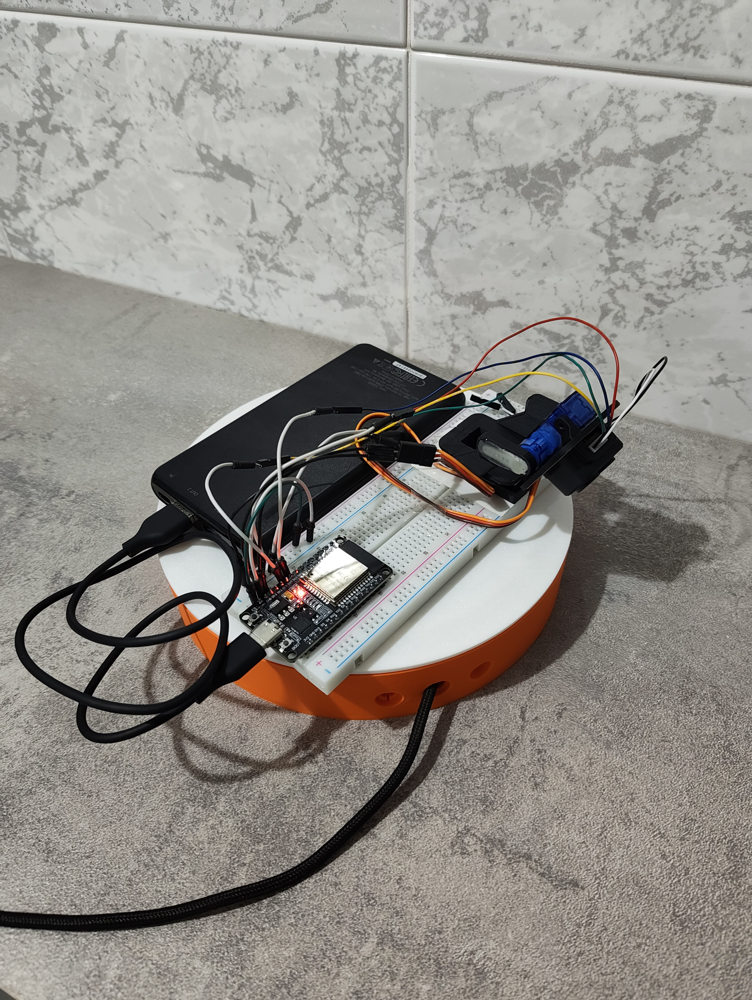
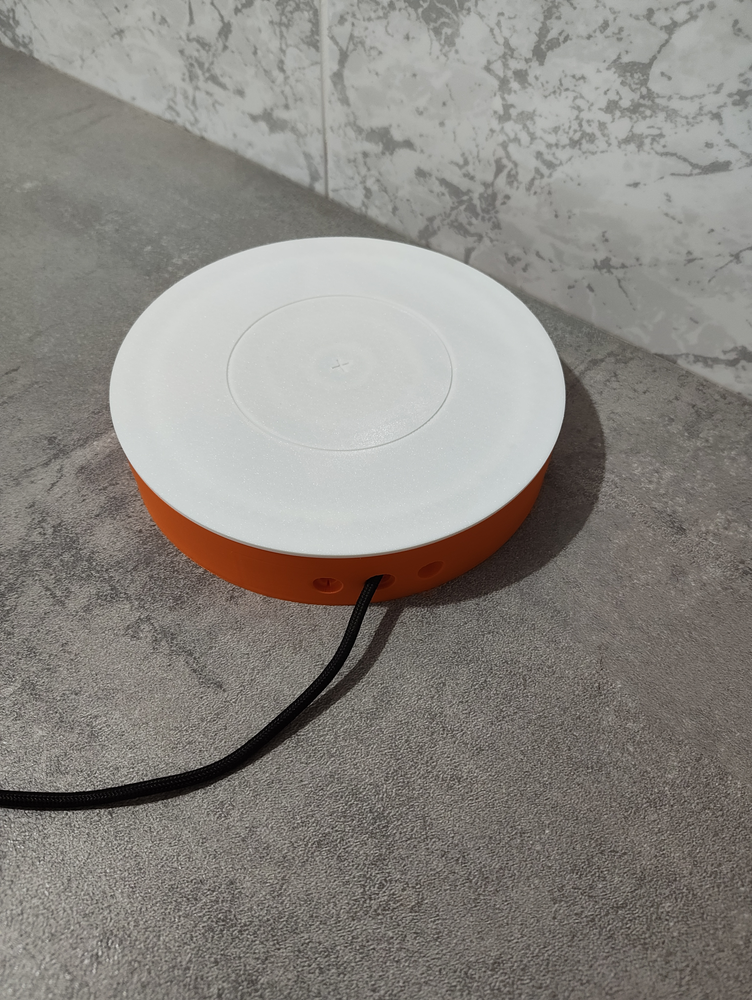
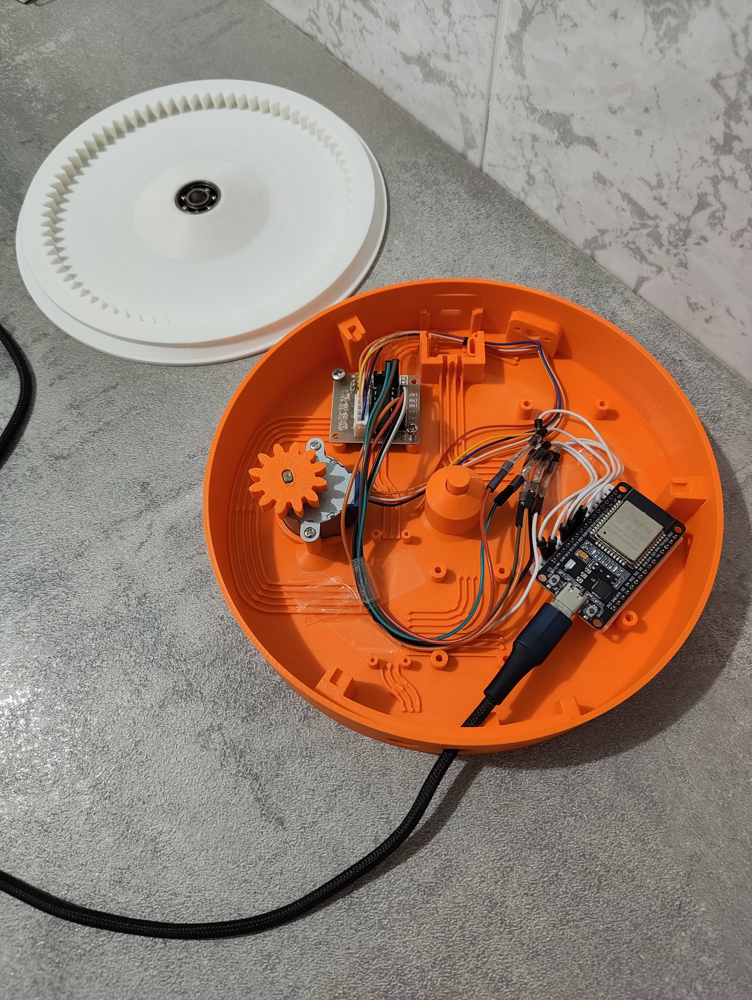
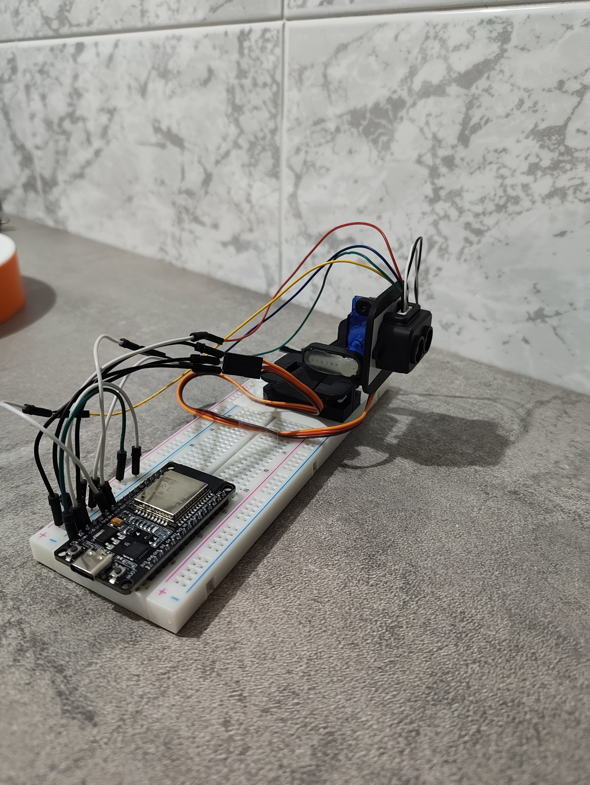
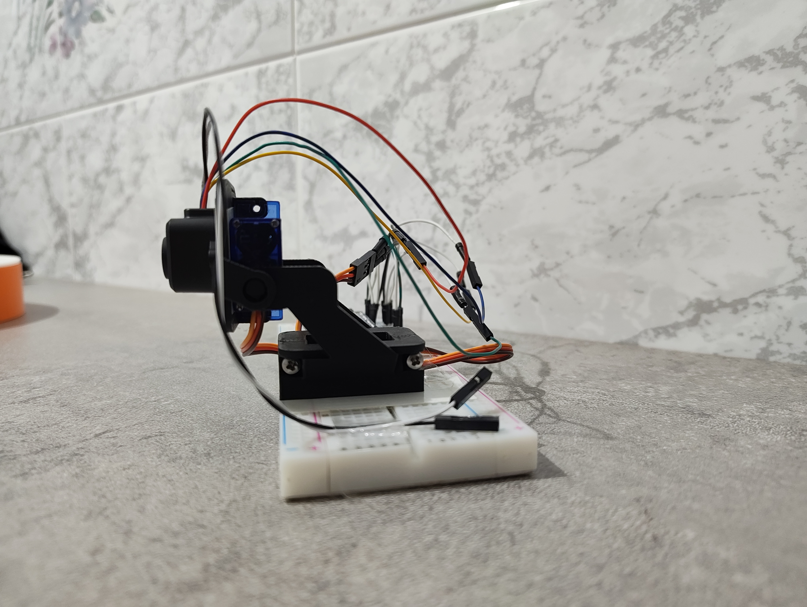

# 🛰️ LiDAR Studio 2D — Real-Time Mapping & Survey Suite

[](https://www.python.org/)
[](https://riverbankcomputing.com/software/pyqt/)
[](https://en.wikipedia.org/wiki/ESP32)
[](https://www.bluetooth.com/)
[](https://en.wikipedia.org/wiki/AutoCAD_DXF)
[](LICENSE)

**LiDAR Studio 2D** is a high-performance desktop survey and real-time 360° 2D mapping platform. Built around a dual-ESP32 wireless architecture streaming over Bluetooth Low Energy (BLE), it features a responsive PyQt6/PyQtGraph dashboard implementing real-time SLAM spatial occupancy, dynamic ray-clearing (free-space carving), and Dietmayer Adaptive Breakpoint Detection (ABD) for intelligent obstacle isolation and CAD surveying.

**Active Dynamic Cone Tracking (Closed-Loop Servo Tracking):** Automatically switches from a 360° panoramic scan to a reactive oscillating sector cone (±15° to ±22°) centered on moving or static targets. Boosts target telemetry update rates from **0.033 Hz up to 0.75 Hz (over 20x faster)** with smooth kinematic sweeps, directional deadbands (≥ 4.5°), and automatic 360° return when toggled off.

> **Universal Hardware & Firmware Ecosystem:** Seamlessly shares the exact same physical hardware and ESP32 firmware with **3D LiDAR Scanner**. In 2D mode, the system automatically commands the pitch gimbal to lock into a level horizon (135°) and handles continuous planar SLAM mapping.

---

## 📸 Live Demonstrations & Software Interface

### 🎯 Dynamic Target Detection & Real-Time Tracking
<p align="center">
  
</p>

### 📐 Interactive CAD Distance Measurements & Planimetry Survey
<p align="center">
  
</p>

---

## 🎬 Video Demonstrations

### 🎯 Dynamic Cone Tracking Sweep
<p align="center">
  <video src="https://github.com/user-attachments/assets/0bba0945-a46e-4bd5-b480-aac1c3e7b68b" width="90%" controls></video>
</p>

### 🗺️ Instant Target Clearance on Sweep
<p align="center">
  <video src="https://github.com/user-attachments/assets/2209494f-8b82-4bdb-b7f4-68df61fd2e87" width="90%" controls></video>
</p>

---

## 🛠️ Physical Hardware Architecture

| Complete Base & Gimbal Assembly | Stepper Rotary Base (Enclosed) | Internal Drive & Controller Board |
| :---: | :---: | :---: |
|  |  |  |

| Pitch Gimbal & Sensor Rig | Gimbal Elevation Mechanism |
| :---: | :---: |
|  |  |

---

## 🌟 Key Features

- **Decoupled Perimeter Mapping & Target Isolation:** Decouples persistent structural walls (cyan points) from dynamic foreground objects (yellow target bounds). Obstacles do not corrupt the floor plan and vanish instantaneously on the next sweep upon removal.
- **Dietmayer Adaptive Breakpoint Detection (ABD + PCA):** Real-time polar clustering with adaptive distance thresholds:
  $$D_{\text{thresh}} = r_{\text{min}} \cdot \frac{\sin(\Delta\theta)}{\sin(\gamma - \Delta\theta)} + C_0$$
  Includes Principal Component Analysis (PCA via `eigvalsh`) to discard flat wall segments and accurately isolate compact obstacles (people, furniture, columns).
- **Dynamic Ray-Clearing (Free-Space Carving):** Traces line-of-sight laser rays across a 3 cm spatial grid, instantly removing ghost artifacts and cleared obstacles.
- **Dedicated Scan Toggle & Safe State Transitions:** Independent **Start / Stop Scan** GUI control. Connecting via BLE keeps the stepper at rest until commanded, preventing motor stalling, high-frequency buzzing, or communication stalls.
- **Fast Cold Calibration (30–60s):** Automatically locks the perimeter geometry in 1–2 initial rotations (with a 6:1 mechanical reduction, 1 full 360° plate rotation takes 30s @ 12 RPM).
- **Interactive Ruler Tool (Click & Measure):** Point-to-point Euclidean canvas measurements with instant distance tags in meters/centimeters, real-time rubberband previews, and quick clear controls.
- **Bidirectional BLE Link:** Real-time speed adjustments (4–16 RPM), software-defined zero-point angular calibration, and non-blocking command dispatching (`PROPERTY_WRITE_NR`).
- **CAD & Metric Data Export:** 1:1 scale DXF vector export (compatible with AutoCAD, Fusion 360, Revit, QCAD) and tabular CSV scan logging.
- **Diagnostic Telemetry:** Polar sweep radar animation, live coordinates under cursor (X, Y, R, θ), and real-time dual-node RSSI signal monitoring (dBm).

---

## 🏗️ System Architecture

```text
                ┌─────────────────────────────────────────────────────────┐
                │                      DESKTOP HOST                       │
                │                                                         │
                │   PyQt6 GUI   <───>   SLAMEngine (3cm Ray-Clear Grid)   │
                │       ▲                               ▲                 │
                │       │                               │                 │
                │   MapCanvas               TargetDetector (ABD + PCA)    │
                │       ▲                               ▲                 │
                │       └───────────────┬───────────────┘                 │
                │                       │                                 │
                │               BLEManager (Bleak)                        │
                └───────────────────────┬─────────────────────────────────┘
                                        │
                         Bluetooth Low Energy (GATT Notifications)
                                        │
                ┌───────────────────────┴───────────────────────┐
                │                                               │
                ▼                                               ▼
┌─────────────────────────────┐                 ┌─────────────────────────────┐
│      ESP32-Stepper-Base     │                 │      ESP32-LiDAR-Tilt       │
│    (28BYJ-48 Stepper 6:1)   │                 │  (TF-Luna ToF + SG90 Servo) │
├─────────────────────────────┤                 ├─────────────────────────────┤
│ • GPIO: 25, 27, 14, 26      │                 │ • UART2: GPIO 27 (RX), 26(TX)│
│ • Big-Endian Angle Stream   │                 │ • PWM: GPIO 13 (Servo locked│
│ • Remote RPM & Zero Calib   │                 │    at 135° Planar Horizon)  │
│ • Non-blocking Step Timing  │                 │ • Continuous UART Ring-Flush│
└─────────────────────────────┘                 └─────────────────────────────┘
